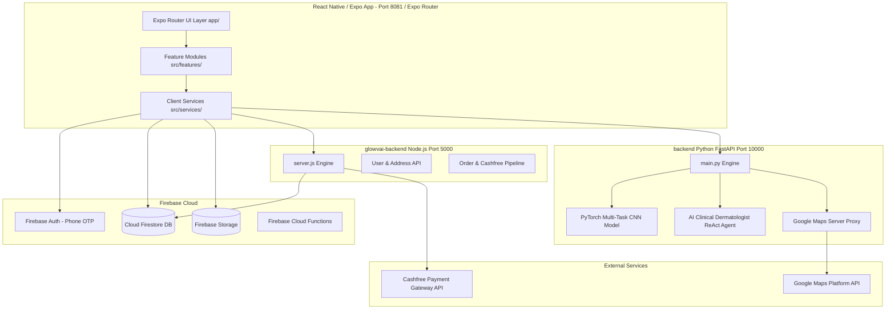

# GlowVAI V2 — AI-Powered Skincare & Quick-Commerce Platform


Welcome to **GlowVAI V2**! A production-grade, end-to-end AI-powered cosmetic skincare e-commerce and hyper-local quick-commerce platform built for the Indian beauty and wellness ecosystem. GlowVAI combines real-time Computer Vision facial diagnostics, an Autonomous AI Clinical Dermatologist ReAct agent, micro-fulfillment dark store geofences (Vijayawada instant delivery), nationwide courier logistics, student rewards, Cashfree payment gateway, and administrative backoffice controls.

---

## 🚀 Key Features & Systems Implemented

### 1. 📲 Phone-Number Authentication & Identity Management
- **Firebase Auth**: Secure SMS OTP authentication (`+91` format) with zero mock stubs.
- **Student Verification & Coin System**: Verified college students upload institutional IDs to unlock exclusive student discounts and earn GlowVAI Coins after referee order delivery and cooling periods.

### 2. 🔬 PyTorch Multi-Task CNN AI Skin Diagnostic Engine
- **Real-Time Camera Scan**: High-fidelity facial scanning for 7 biometric metrics:
  - Acne severity (Grades 0–3)
  - Hydration level (%)
  - Surface texture & roughness
  - Hyperpigmentation & dark spot density
  - Sebum level & oiliness balance
  - Skin sensitivity score
  - Skin tone & undertone classification
- **Clinical Explainability**: Generates personalized visual overlays, metric breakdowns, and actionable routine recommendations.

### 3. 👩‍⚕️ Autonomous AI Clinical Dermatologist Agent
- **ReAct Agent Architecture**: Multi-step ReAct agent operating with specialized clinical tools (`analyze_face_biometrics`, `verify_ingredient_contraindications`, `match_clinical_skincare_routine`, `calculate_express_delivery_eta`).
- **Ingredient Contraindication Audit**: Automated safety engine detecting unsafe active ingredient combinations (e.g., Retinol + BHA layering warnings, Benzoyl Peroxide + Vitamin C interactions).
- **1-Click Routine Checkout**: Prescribes custom AM/PM routines directly loadable into the cart with 1 click.

### 4. ⚡ Hybrid Delivery Logistics Engine
- **Vijayawada Quick-Commerce**: 30–60 minute instant delivery using Ray-Casting **Point-in-Polygon (PIP)** geofence algorithms to check user GPS coordinates against local dark store service polygons.
- **Pan-India Standard Delivery**: Courier logistics serving all valid Indian PIN codes within 3–7 business days when out of quick-commerce zones or items are in central fulfillment centers.

### 5. 💳 Cashfree Payment Gateway & Coin Wallet
- **Native UPI & Card Checkout**: Cashfree PG integration supporting UPI Intent, Cards, Net Banking, and Wallet payments.
- **Server-Side Security**: Session creation (`payment_session_id`), webhooks, and payment signature verification.
- **Stackable Discounts**: Seamless combination of promo coupons and GlowVAI referral coin redemptions.

### 6. 🛡️ Beauty Protection Warranty System
- **Adverse Reaction & Transit Protection**: Optional product warranty coverage for sensitive skincare formulations.
- **Claim Workflow**: Photo proof submission and backoffice admin approval engine for rapid replacements/refunds.

---

## 🏛️ System Architecture



---

## 📁 Repository Directory Structure

```
glowvaisathweek-main/
├── app/                  # Expo Router file-based mobile app routes (tabs, screens, modals)
│   ├── (auth)/           # Authentication screens (Login, OTP, Student verify)
│   ├── (tabs)/           # Navigation tabs (Home, Diagnostics, Catalog, Cart, Profile)
│   ├── _layout.tsx       # Root app layout & provider setup
│   └── index.tsx         # Entry splash / redirect router
├── src/                  # Modular application logic & features
│   ├── components/       # Reusable UI components & design system primitives
│   ├── design/           # Design system tokens, color palettes, and typography
│   ├── features/         # Domain-driven features (auth, scan, shop, cart, orders, location)
│   └── services/         # API integration services (Firebase, Express, FastAPI, Cashfree)
├── glowvai-backend/      # Express Node.js App & Payment Backend API (Port 5000)
│   ├── server.js         # Core Express application entrypoint
│   └── package.json      # Backend Node dependencies
├── backend/              # Python FastAPI AI Inference & Autonomous Agent Server (Port 10000)
│   ├── main.py           # FastAPI application server entrypoint
│   └── ai_consultant.py  # ReAct AI Dermatologist Agent implementation
├── cnn_model/            # PyTorch Deep Learning Skin Diagnostic Model
│   ├── model.py          # Multi-task CNN network definition
│   └── weights/          # Trained PyTorch model checkpoints
├── admin/                # Web Admin Portal for dark store operations & catalog management
├── functions/            # Firebase Cloud Functions (TypeScript serverless backend)
├── docs/                 # Master technical specifications & architecture documentation
├── logs/                 # Chronological development & design decision logs
├── scripts/              # Database seeding, dev setup, and emulator scripts
└── tests/                # Playwright E2E tests, unit tests, and security rules validation
```

---

## 📚 Master Documentation Index (`docs/`)

Click on any document below to inspect detailed system specifications:

| Document | Description | Link |
| :--- | :--- | :--- |
| **Mobile Docs Hub** | Complete mobile application technical architecture, touch performance, and React Native Expo setup. | [docs/mobile_docs/README.md](file:///d:/Client%20Projects/GlowVai/glowvaisathweek-main/docs/mobile_docs/README.md) |
| **Web Docs Hub** | Complete web customer portal, WebRTC camera scanner, dark store dispatch, and admin backoffice suite. | [docs/web_docs/README.md](file:///d:/Client%20Projects/GlowVai/glowvaisathweek-main/docs/web_docs/README.md) |
| **70-Screen Performance** | Master guide for sub-100ms touch latency, 60fps native navigation, Hermes engine, and 8-layer performance architecture. | [70_SCREEN_TOUCH_AND_PERFORMANCE_OPTIMIZATION.md](file:///d:/Client%20Projects/GlowVai/glowvaisathweek-main/docs/70_SCREEN_TOUCH_AND_PERFORMANCE_OPTIMIZATION.md) |
| **Project Architecture** | Master architectural blueprint, system components, data flows, and subsystem interactions. | [PROJECT_ARCHITECTURE_OVERVIEW.md](file:///d:/Client%20Projects/GlowVai/glowvaisathweek-main/docs/PROJECT_ARCHITECTURE_OVERVIEW.md) |
| **AI & Model Specs** | PyTorch CNN specifications, biometric parameters, explainability model, and ReAct agent. | [AI_CNN_MODEL_SPECIFICATION.md](file:///d:/Client%20Projects/GlowVai/glowvaisathweek-main/docs/AI_CNN_MODEL_SPECIFICATION.md) |
| **Backend API Spec** | Complete RESTful API endpoints for Express (Port 5000) and FastAPI (Port 10000). | [BACKEND_API_SPECIFICATION.md](file:///d:/Client%20Projects/GlowVai/glowvaisathweek-main/docs/BACKEND_API_SPECIFICATION.md) |
| **Payments & Checkout** | Cashfree PG integration, cart calculation algorithms, coin redemptions, and checkout rules. | [PAYMENT_AND_CHECKOUT_INTEGRATION.md](file:///d:/Client%20Projects/GlowVai/glowvaisathweek-main/docs/PAYMENT_AND_CHECKOUT_INTEGRATION.md) |
| **Dev & Deployment** | Step-by-step local setup, Render cloud deployment, Firebase rules, and EAS APK builds. | [DEVELOPMENT_AND_DEPLOYMENT_GUIDE.md](file:///d:/Client%20Projects/GlowVai/glowvaisathweek-main/docs/DEVELOPMENT_AND_DEPLOYMENT_GUIDE.md) |
| **Database Schema** | Cloud Firestore collections, document TypeScript interfaces, security rules, and indexes. | [DATABASE_SCHEMA.md](file:///d:/Client%20Projects/GlowVai/glowvaisathweek-main/docs/DATABASE_SCHEMA.md) |
| **Delivery Rules** | Geofencing polygon PIP algorithms, dark store operations, and serviceability rules. | [DELIVERY_RULES.md](file:///d:/Client%20Projects/GlowVai/glowvaisathweek-main/docs/DELIVERY_RULES.md) |
| **Referral Rules** | Student verification workflow, referral coin calculations, holding period, and anti-fraud rules. | [REFERRAL_RULES.md](file:///d:/Client%20Projects/GlowVai/glowvaisathweek-main/docs/REFERRAL_RULES.md) |
| **Beauty Protection** | Product warranty coverage, adverse reaction claim workflows, and refund policies. | [BEAUTY_PROTECTION_RULES.md](file:///d:/Client%20Projects/GlowVai/glowvaisathweek-main/docs/BEAUTY_PROTECTION_RULES.md) |
| **Security & Privacy** | Zero-secrets standards, Firestore security rules, biometrics privacy, and medical disclaimers. | [SECURITY_AND_PRIVACY.md](file:///d:/Client%20Projects/GlowVai/glowvaisathweek-main/docs/SECURITY_AND_PRIVACY.md) |
| **Tech Stack Spec** | Technology choices breakdown (React Native, Expo, PyTorch, Node.js, FastAPI, Cashfree). | [TECH_STACK.md](file:///d:/Client%20Projects/GlowVai/glowvaisathweek-main/docs/TECH_STACK.md) |
| **Screens 21–40 Summary** | Complete Mode B Clean Light + Coral re-theme, TSX code updates, and renumbering log for Screens 21 to 40. | [SCREENS_21_TO_40_WORK_DONE.md](file:///d:/Client%20Projects/GlowVai/glowvaisathweek-main/docs/screens/SCREENS_21_TO_40_WORK_DONE.md) |
| **Screens Directory** | Complete 70 screens technical specifications directory and master table. | [docs/screens/README.md](file:///d:/Client%20Projects/GlowVai/glowvaisathweek-main/docs/screens/README.md) |
| **Screens Tracker** | 125 planned UI screens breakdown and MVP implementation progress tracker. | [USER_SCREENS_CHECKLIST.md](file:///d:/Client%20Projects/GlowVai/glowvaisathweek-main/docs/USER_SCREENS_CHECKLIST.md) |

---

## 🛠️ Technology Stack

| Domain | Technology / Library | Version / Details |
| :--- | :--- | :--- |
| **Mobile Client Framework** | React Native / Expo | Expo SDK 52, React Native 0.76.9 |
| **Mobile Routing** | Expo Router | File-based routing (v4.0) |
| **UI & Styling** | Vanilla React Native StyleSheets | Syne / Inter fonts, Linear Gradients, Custom Design Tokens |
| **App Backend** | Node.js / Express.js | Express v5 (Port 5000) |
| **AI Inference Backend** | Python / FastAPI / Uvicorn | Python 3.10+, FastAPI (Port 10000) |
| **Machine Learning** | PyTorch / torchvision / OpenCV | Custom Multi-Task CNN Architecture |
| **Database & Auth** | Firebase Cloud Firestore & Auth | Phone SMS OTP, Real-time Listeners |
| **Storage** | Firebase Cloud Storage | Cloud asset hosting & private file TTLs |
| **Payment Gateway** | Cashfree PG SDK & Webhooks | Native UPI Intent, Card checkout |
| **Maps & Geolocation** | Google Maps API & expo-location | Custom Ray-Casting PIP algorithm |

---

## ⚡ Quick Start & Setup Guide

### 1. Prerequisites
- **Node.js**: v18.x or higher
- **Python**: v3.10 or higher
- **Expo Go / Android Studio**: For running Android emulator or physical device testing

### 2. Environment Setup
Create a `.env` file in the root directory by copying `.env.example`:
```bash
cp .env.example .env
```
Fill in your required credentials:
- Firebase Web & Admin SDK Keys
- Cashfree API App ID & Secret Key
- Google Maps API Key

### 3. Install Client & Backend Dependencies

```bash
# Install Mobile App Dependencies
npm install

# Install Express Backend Dependencies
cd glowvai-backend
npm install
cd ..

# Install Python Backend Dependencies
pip install -r backend/requirements.txt
```

### 4. Run Development Servers

Open separate terminal windows for each service:

#### Start Express App Backend (Port 5000)
```bash
cd glowvai-backend
node server.js
```

#### Start Python FastAPI AI Engine (Port 10000)
```bash
python -m uvicorn backend.main:app --host 0.0.0.0 --port 10000 --reload
```

#### Start Expo React Native Mobile App (Port 8081)
```bash
npm run dev
```

---

## 🛡️ Engineering Standards & Security Principles

1. **Zero Mock Policy**: Production code paths run authentic network, database, and machine learning pipelines without fake hardcoded stubs.
2. **Graceful Network States**: Every screen natively manages `Loading`, `Success`, `Error`, `Empty`, and `Offline` states.
3. **Biometric Privacy**: Raw facial scanning geometries are processed transiently in-memory and are never permanently persisted without explicit user consent.
4. **Zero-Secrets Policy**: Security keys, API tokens, and database secrets are strictly managed via environment variables (`.env`) and kept out of git history.

---

## 📄 License & Ownership

Copyright © 2026 GlowVAI Team. All rights reserved. Confidential and proprietary software platform.

