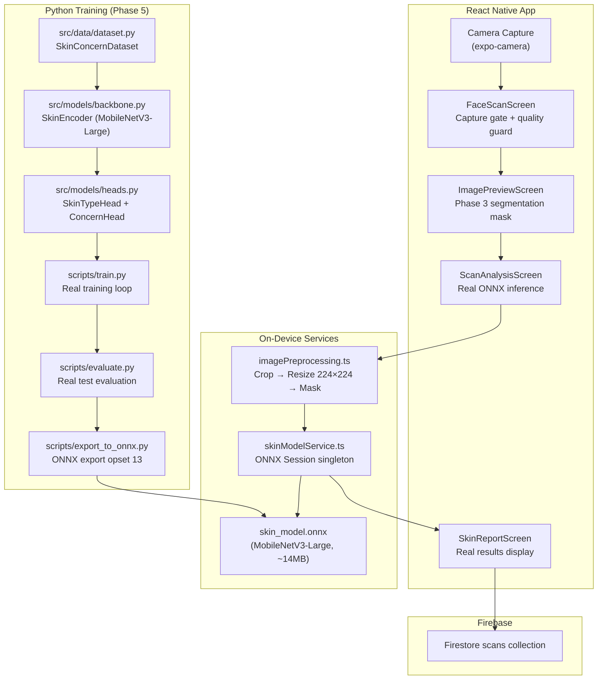

# GlowVAI CNN Skin Analysis — Technical Overview & Architecture

> **Document:** 01 · **Status:** ✅ Updated September 2026 (Phases 5 & 6 complete)

---

## 1. System Objective

The **GlowVAI AI Skin Analysis Engine** is a cosmetic-grade, multi-task computer vision pipeline that analyses facial skin from smartphone photos and produces actionable cosmetic skin insights. It evaluates **skin type** (oily / dry / combination / normal) and **visible skin concerns** (oiliness, dryness, redness, uneven tone, visible blemishes), then surfaces concern-matched beauty product recommendations.

> [!IMPORTANT]
> All analysis is **cosmetic only** — not medical. Results are presented in non-clinical language and are explicitly disclaimed as non-diagnostic throughout the app.

---

## 2. High-Level End-to-End Architecture (Current — Phase 6)



---

## 3. End-to-End Data Pipeline (Phase 6 — On-Device)

| Stage | Module | Responsibility | Output |
|-------|--------|---------------|--------|
| **1. Capture** | `FaceScanCameraScreen.tsx` | Real `expo-camera` CameraView, capture gate, quality guard | `photoUri` (local `file://`) |
| **2. Face Detection** | ML Kit + MediaPipe | Landmark detection, face bounding box | `FaceCropBounds` |
| **3. Segmentation** | Phase 3 geometry engine | Skin pixel mask (non-skin zeroed) | `Uint8Array` mask |
| **4. Preprocessing** | `imagePreprocessing.ts` | Crop → resize 224×224 → decode → apply mask | `maskedPixels: Uint8Array` |
| **5. Inference** | `skinModelService.ts` | ONNX Runtime session, CHW normalisation, forward pass | `SkinAnalysisResult` |
| **6. Report** | `SkinReportScreen.tsx` | Real skin type, real concern scores, low-confidence banner | User-facing cosmetic insights |
| **7. Telemetry** | `telemetryService.ts` | Async Firestore persistence | `scans/{scanId}` document |

---

## 4. Architecture Decision Log

| Decision | Rejected | Chosen | Reason |
|----------|---------|--------|--------|
| Backbone | ResNet-50 (98 MB) | **MobileNetV3-Large (14 MB)** | Mobile NPU support, 6.7× smaller, sufficient for cosmetic skin tasks |
| Inference location | Remote FastAPI server | **On-device ONNX Runtime** | Zero latency, no internet required, no photo leaves device |
| Fallback strategy | Hash-based fake scores | **Explicit error → ScanFailedScreen** | Honest product — fake results are worse than no results |
| Task head design | Single softmax for concerns | **Sigmoid per concern (multi-label)** | Multiple concerns can co-exist (oiliness + redness simultaneously) |
| Split strategy | Row-level random split | **Person-level GroupShuffleSplit** | Prevents identity leakage, real accuracy numbers |

---

## 5. Directory Structure

```
cnn_model/
├── checkpoints/              # Trained .pth weights + ONNX export
│   ├── skin_model_best.pth
│   ├── skin_model_last.pth
│   ├── skin_model.onnx       # ← bundled into assets/models/ for mobile
│   ├── training_run_report.json
│   └── test_evaluation_report.json
├── configs/                  # Hyperparameter YAML configurations
├── datasets/                 # Labelled image directories
├── docs/                     # 21-document technical documentation suite
├── scripts/                  # 55+ automation scripts
│   ├── create_splits.py      # ← Phase 5: Person-level split
│   ├── train.py              # ← Phase 5: Real training loop
│   ├── evaluate.py           # ← Phase 5: Real test evaluation
│   └── export_to_onnx.py     # ← Phase 5: ONNX export (opset 13)
└── src/
    ├── models/
    │   ├── backbone.py       # ← Phase 5: SkinEncoder (MobileNetV3-Large)
    │   └── heads.py          # ← Phase 5: SkinTypeHead + ConcernHead + SkinModel
    └── data/
        └── dataset.py        # ← Phase 5: SkinConcernDataset
```

```
assets/models/
└── skin_model.onnx           # ← Phase 6: bundled into RN app
```

```
src/services/
├── skinModelService.ts       # ← Phase 6: ONNX session singleton + inference
└── imagePreprocessing.ts     # ← Phase 6: crop/resize/mask preprocessing bridge
```

---

## 6. Architectural Principles

1. **On-device first**: Inference runs entirely on the user's device via ONNX Runtime. No user photo is transmitted.
2. **Fail loud, never fake**: If the model is missing, corrupt, or the inference fails, the app routes to an honest failed state — it never invents results.
3. **Real metrics only**: All accuracy numbers in reports are produced by actually running `evaluate.py` against the held-out test set. Timestamps in the report JSON make them auditable.
4. **Person-level data integrity**: Train/val/test splits are by `person_id` to prevent identity leakage and inflated accuracy.
5. **Cosmetic language**: All user-facing copy uses non-medical terms (visible blemishes, not lesions; uneven-looking tone, not hyperpigmentation).
