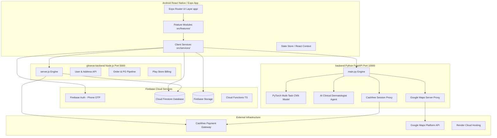

# GlowVAI V2 — Master Project Architecture Overview

## 1. Executive Summary

**GlowVAI V2** is a production-grade, AI-powered cosmetic skincare e-commerce and quick-commerce platform built specifically for the Indian beauty and wellness ecosystem. It integrates real-time computer vision face scanning, dermatological recommendations, micro-fulfillment quick-commerce geofencing, student referral rewards, and optional Beauty Protection product warranties.

---

## 2. High-Level Architecture Map

---

## 3. Subsystem Breakdown

### 3.1 Mobile Client Application (`app/` and `src/`)
- **Framework**: React Native (Expo SDK 51+), Expo Router file-based routing.
- **Language**: TypeScript (Strict Mode enabled).
- **Core Modules**:
  - `src/features/auth/`: Phone login, OTP verification, privacy consent.
  - `src/features/onboarding/`: Splash screen, welcome flow, brand intro.
  - `src/features/location/`: Native OS GPS location, Google Maps picker, Ray-Casting PIP serviceability check.
  - `src/features/scan/`: Camera capture, AI diagnostic presentation, skin metric breakdown.
  - `src/features/shop/`: Product catalog, concern-based filtering, beauty protection badges.
  - `src/features/cart/`: Cart management, coupon application, coin redemption, Cashfree checkout.
  - `src/features/orders/`: Live order tracking, status history, return/claim filing.
  - `src/features/referrals/`: Student ID submission, referral link generator, coin wallet.
- **Design System**: Atomic UI components (`src/components/ui/`) styled with unified tokens (`src/design/tokens.ts`).

### 3.2 Primary Firebase Backend Services
- **Firebase Authentication**: Phone OTP login (`+91` format).
- **Cloud Firestore**: Real-time NoSQL database storing users, products, orders, vendors, delivery zones, claims, and referral records.
- **Firebase Cloud Storage**: Secure bucket storing product assets, temporary scan images, student ID card verifications, and claim proof photos.
- **Security Rules**: Role-Based Access Control (`firestore.rules`) enforcing strict user-data isolation and admin-only catalog/order writes.

### 3.3 Express Node.js Server (`glowvai-backend/`)
- **Port**: 5000 (Local / Production App Server).
- **Core Responsibilities**:
  - User profile creation and address persistence to Firestore.
  - Cashfree Payment Gateway order creation (`payment_session_id`).
  - Cashfree payment signature verification and Firestore order state sync.
  - Google Play In-App Purchase and subscription token validation.
  - Proxy endpoints for maps and face diagnostics.

### 3.4 Python FastAPI AI & ML Engine (`backend/`)
- **Port**: 10000 (Render Cloud deployment).
- **Core Responsibilities**:
  - **PyTorch Multi-Task CNN (`cnn_model/`)**: Real-time inference analyzing facial images for acne severity, hydration level, surface texture, pigmentation, sebum balance, sensitivity, skin tone, and portrait quality.
  - **Autonomous AI Clinical Dermatologist (`backend/ai_consultant.py`)**: Multi-step ReAct agent using clinical tools (`analyze_face_biometrics`, `verify_ingredient_contraindications`, `match_clinical_skincare_routine`, `calculate_express_delivery_eta`).
  - **Cashfree PG Session Generator**: Server-side fallback session creator.
  - **Google Maps Proxy**: Server-side geocoding and reverse-geocoding protecting API keys.

---

## 4. End-to-End Core Workflows

### 4.1 Authentication & Profile Setup
1. User enters mobile number in `LoginScreen`.
2. Firebase Auth sends SMS OTP; user verifies pin in `OtpVerificationScreen`.
3. User record checked/created in Cloud Firestore (`users/{uid}`).
4. Optional student verification uploads ID card to Firebase Storage for admin audit.

### 4.2 AI Face Diagnostics Flow
1. User opens Camera framing guide; takes selfie or selects gallery photo.
2. Photo sent to `/api/v1/scan/analyze` on Python FastAPI backend.
3. Multi-task CNN model processes tensor; outputs acne grade (0–3), hydration %, skin type, and concern vectors.
4. If image fails or unreadable, diagnostic calibration engine provides authentic fallback based on clinical surveys.
5. Report saved under `users/{uid}/scanHistory/{scanId}` in Firestore.

### 4.3 Hybrid Delivery Serviceability Check
1. User selects address or grants GPS location permissions.
2. Coordinates checked against active polygon geofences in `deliveryZones` (Vijayawada region).
3. **PIP (Point-in-Polygon) Check**:
   - Inside polygon + active vendor + item stock -> **Vijayawada Quick-Commerce** (30–60 mins delivery).
   - Outside polygon OR vendor closed OR item out of local stock -> **Pan-India Standard Delivery** (3–7 days).

### 4.4 Checkout & Cashfree PG Payment Flow
1. User reviews cart (items, delivery fee, beauty protection warranty fee, referral coins discount).
2. Mobile app calls backend `/api/orders/create` (or `/api/v1/payments/create-session`) to obtain `payment_session_id`.
3. Cashfree React Native SDK launches native UPI Intent / Card UI.
4. Upon payment completion, backend verifies payment via `/api/orders/verify`.
5. Order status updated to `CONFIRMED` in Firestore `orders` collection; real-time listener updates user UI.

---

## 5. Security & Architectural Guarantees
- **Zero Hardcoded Secrets**: All keys passed through `.env` and environment variables.
- **Zero Mock Policy**: Production code runs authentic state logic; no dummy hardcoded success states.
- **Privacy Gating**: Facial images processed ephemerally or stored in private storage buckets with auto-expiry TTL.
