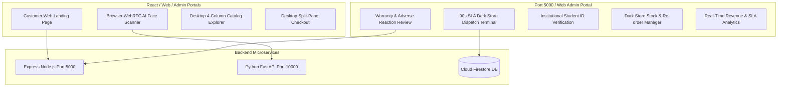

# GlowVAI Web Application & Admin Operations Documentation Hub

Welcome to the official technical documentation for the **GlowVAI Web Platform**, encompassing the Customer Web Portal, Desktop AI Skin Diagnostics, Web Cashfree Checkout, and the Web Admin Operations Backoffice.

---

## 🌐 Web Architecture Overview

The web suite is designed for desktop, tablet, and mobile browsers, providing high-resolution marketing, browser camera diagnostics, and real-time operational control for dark store managers and claims auditors.



---

## 📚 Web Application Screen Master Index (`docs/screens/web/`)

Below are the 10 core Web App & Admin Backoffice screens documented in detail:

| # | Screen Name | Specification File | Main Features / Purpose |
|---|-------------|--------------------|-------------------------|
| **01** | **Customer Web Landing** | [`01_WEB_LANDING_PAGE.md`](file:///d:/Client%20Projects/GlowVai/glowvaisathweek-main/docs/screens/web/01_WEB_LANDING_PAGE.md) | High-converting marketing landing page, hero carousel, AI feature demo. |
| **02** | **Web Browser AI Scanner** | [`02_WEB_AI_SCANNER.md`](file:///d:/Client%20Projects/GlowVai/glowvaisathweek-main/docs/screens/web/02_WEB_AI_SCANNER.md) | WebRTC browser camera diagnostic scanner with real-time biometric canvas. |
| **03** | **Desktop Catalog Explorer** | [`03_WEB_CATALOG_EXPLORER.md`](file:///d:/Client%20Projects/GlowVai/glowvaisathweek-main/docs/screens/web/03_WEB_CATALOG_EXPLORER.md) | 4-column responsive product grid with multi-facet sidebar filtering. |
| **04** | **Web Product Detail & Routine** | [`04_WEB_PRODUCT_DETAIL.md`](file:///d:/Client%20Projects/GlowVai/glowvaisathweek-main/docs/screens/web/04_WEB_PRODUCT_DETAIL.md) | High-res image gallery, clinical trial data, ingredient transparency breakdown. |
| **05** | **Web Cart & Checkout** | [`05_WEB_CART_CHECKOUT.md`](file:///d:/Client%20Projects/GlowVai/glowvaisathweek-main/docs/screens/web/05_WEB_CART_CHECKOUT.md) | Split-pane checkout view with Cashfree Web JS SDK payment integration. |
| **06** | **Darkstore Dispatch Terminal** | [`06_WEB_DARKSTORE_PICKING_DASHBOARD.md`](file:///d:/Client%20Projects/GlowVai/glowvaisathweek-main/docs/screens/web/06_WEB_DARKSTORE_PICKING_DASHBOARD.md) | Store Manager 90-second picking SLA queue & rider assignment board. |
| **07** | **Warranty Claims Portal** | [`07_WEB_WARRANTY_CLAIMS_PORTAL.md`](file:///d:/Client%20Projects/GlowVai/glowvaisathweek-main/docs/screens/web/07_WEB_WARRANTY_CLAIMS_PORTAL.md) | Backoffice audit interface for reviewing adverse reaction & transit damage claims. |
| **08** | **Student ID Verification** | [`08_WEB_STUDENT_VERIFICATION_AUDIT.md`](file:///d:/Client%20Projects/GlowVai/glowvaisathweek-main/docs/screens/web/08_WEB_STUDENT_VERIFICATION_AUDIT.md) | Admin portal for verifying uploaded college ID cards and releasing Glow Coins. |
| **09** | **Inventory & Stock Manager** | [`09_WEB_INVENTORY_STOCK_MANAGER.md`](file:///d:/Client%20Projects/GlowVai/glowvaisathweek-main/docs/screens/web/09_WEB_INVENTORY_STOCK_MANAGER.md) | Dark store stock levels, low-inventory alerts, and automated purchase orders. |
| **10** | **Analytics & Revenue Board** | [`10_WEB_ANALYTICS_REVENUE_DASHBOARD.md`](file:///d:/Client%20Projects/GlowVai/glowvaisathweek-main/docs/screens/web/10_WEB_ANALYTICS_REVENUE_DASHBOARD.md) | Real-time sales telemetry, delivery SLA performance, and diagnostic metrics. |

---

## 💻 Running the Web Suite

```bash
# 1. Run Web Client (Metro for Web / Port 8081)
npx expo start --web

# 2. Run Express Backend & Web Admin API (Port 5000)
cd glowvai-backend
node server.js

# 3. Run FastAPI AI Diagnostic Engine (Port 10000)
python -m uvicorn backend.main:app --host 0.0.0.0 --port 10000 --reload
```

---
*Maintained by GlowVAI Web & Operations Engineering Team.*
